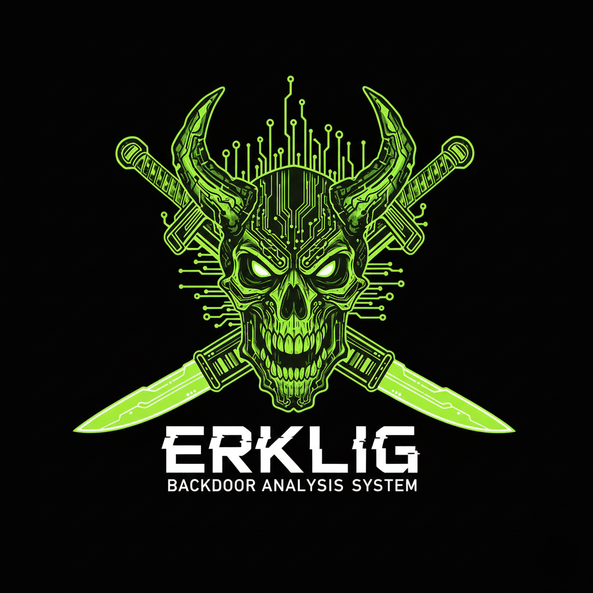

<p align="center">
  
</p>

<h1 align="center">⚔️ ERKLIG</h1>

<p align="center">
  <strong>Mighty Backdoor Analysis Engine</strong><br>
  <em>"Inspired by Erlik Khan, the powerful deity of Turkish mythology"</em>
</p>

<p align="center">
  <a href="#features">Features</a> •
  <a href="#installation">Installation</a> •
  <a href="#usage">Usage</a> •
  <a href="#false-positive-prevention">False Positive Prevention</a> •
  <a href="#roadmap">Roadmap</a> •
  <a href="#contributing">Contributing</a>
</p>

<p align="center">
  <a href="https://github.com/iamcanturk/erklig/releases">
    
  </a>
  <a href="LICENSE">
    
  </a>
  
  
  <a href="https://github.com/iamcanturk/erklig/stargazers">
    
  </a>
</p>

<p align="center">
  <a href="https://iamcanturk.dev">🌐 Website</a> •
  <a href="https://twitter.com/iamcanturk">🐦 Twitter</a> •
  <a href="https://github.com/iamcanturk">💻 GitHub</a>
</p>

---

## 🌟 About

**ERKLIG** is a powerful, open-source security tool written in Go, designed to detect hidden backdoors, web shells, and malicious code snippets in web servers. Built for security professionals, system administrators, and developers who need to quickly scan and analyze potentially compromised web applications.

### 🎉 v2.0.0 - Mighty Engine

> **Complete rewrite in Go!** ERKLIG now features parallel scanning, entropy-based detection, and professional HTML reports. The original Bash version is preserved as `erklig-lite.sh` for lightweight deployments.

### 🏛️ Name Origin

> **Erklig (Erklik)**: Means "mighty" and "powerful" in Turkish mythology. Derived from **Erlik Khan**, the ruler of the underworld in Turkic mythology. Just as Erlik Khan governs the dark realm, ERKLIG uncovers threats hiding in the dark corners of your servers.

---

## ✨ Features

### 🔍 Multi-Phase Threat Detection

| Phase | Type | Description |
|-------|------|-------------|
| **Phase 1** | Signature-Based | Scans for 30+ known malware patterns and dangerous functions |
| **Phase 2** | Anomaly Detection | Identifies suspicious double extensions (.jpg.php, .txt.php) |
| **Phase 3** | Permission Analysis | Flags files with dangerous permissions (777, 666) |
| **Phase 4** | Entropy Analysis | Detects obfuscated/encrypted code |

### ⚡ Performance Features

- **Parallel Scanning**: Multi-threaded with configurable concurrency
- **10x Faster**: Compared to Bash version on large codebases
- **Cross-Platform**: Linux, macOS, Windows support
- **Single Binary**: No dependencies, just download and run

### 🛡️ Detected Threat Signatures

```
Command Execution    : shell_exec, passthru, system(), popen, proc_open, pcntl_exec
Code Evaluation      : eval(), assert(), preg_replace with /e modifier
Encoding/Obfuscation : base64_decode, gzinflate, gzuncompress, str_rot13
Known Webshells      : FilesMan, WSO, c99shell, r57shell
Network Functions    : fsockopen, socket_accept, curl_exec
Filesystem Abuse     : symlink, chmod, chown
```

### 🎯 Smart Filtering (Reduce False Positives)

- **Whitelist System**: Automatically excludes known safe directories
- **CMS-Aware**: Pre-configured for WordPress, Joomla, Laravel, and more
- **Extension Filtering**: Only scans relevant web file types
- **Interactive Review**: Manual confirmation before flagging threats

### 🖥️ Interactive Analysis Mode

- Step-by-step file review with progress indicator
- Syntax-highlighted code viewing (with `bat` support)
- One-key threat marking or safe flagging
- File metadata display (size, date, permissions)

### 📊 Professional Reporting

- Detailed threat report generation
- Cleanup command suggestions
- Color-coded terminal output

---

## 🚀 Installation

### Option 1: Download Binary (Recommended)

```bash
# Download latest release
curl -sSL https://github.com/iamcanturk/erklig/releases/latest/download/erklig-linux-amd64 -o erklig
chmod +x erklig

# Or for macOS (Apple Silicon)
curl -sSL https://github.com/iamcanturk/erklig/releases/latest/download/erklig-darwin-arm64 -o erklig
chmod +x erklig
```

### Option 2: Build from Source

**Requirements:**
- Go 1.21+ (https://go.dev/dl/)

```bash
# Clone the repository
git clone https://github.com/iamcanturk/erklig.git
cd erklig

# Build
go build -o erklig ./cmd/erklig

# Or install globally
go install ./cmd/erklig
```

### Option 3: Bash Lite Version

For lightweight deployments without Go:

```bash
# Download Bash version
curl -sSL https://raw.githubusercontent.com/iamcanturk/erklig/main/erklig-lite.sh -o erklig-lite.sh
chmod +x erklig-lite.sh
```

---

## 📘 Usage

### Basic Scan

```bash
# Scan a directory
./erklig -t /var/www/html

# Scan with reports
./erklig -t /var/www/html --json --html -o threat_report

# Scan files modified in last 30 days
./erklig -t /var/www/html --days 30

# Non-interactive mode (for scripts/CI)
./erklig -t /var/www/html --no-interact
```

### Command Line Options

| Flag | Description |
|------|-------------|
| `-t, --target` | Target directory to scan |
| `-o, --output` | Output file name (without extension) |
| `--json` | Generate JSON report |
| `--html` | Generate HTML report |
| `--days` | Only scan files modified within N days |
| `--no-interact` | Non-interactive mode |
| `-v, --version` | Show version |
| `-h, --help` | Show help |

### Interactive Commands

| Key | Action | Description |
|-----|--------|-------------|
| `T` | **Threat** | Mark file as malicious, add to report |
| `S` | **Safe** | Mark file as safe, skip to next |
| `V` | **View** | Open full source code in viewer |
| `Q` | **Quit** | Exit analysis immediately |

### Example Output

```
  ███████╗██████╗ ██╗  ██╗██╗     ██╗ ██████╗ 
  ██╔════╝██╔══██╗██║ ██╔╝██║     ██║██╔════╝ 
  █████╗  ██████╔╝█████╔╝ ██║     ██║██║  ███╗
  ██╔══╝  ██╔══██╗██╔═██╗ ██║     ██║██║   ██║
  ███████╗██║  ██║██║  ██╗███████╗██║╚██████╔╝
  ╚══════╝╚═╝  ╚═╝╚═╝  ╚═╝╚══════╝╚═╝ ╚═════╝ 

  ⚔️  ERKLIG BACKDOOR ANALYSIS SYSTEM ⚔️
      v1.3.0 - Mighty Engine
      by Can TURK | https://iamcanturk.dev

[PHASE 1/3] Running signature-based code analysis...
[PHASE 2/3] Scanning for file extension anomalies...
[PHASE 3/3] Checking for permission anomalies...

╔══════════════════════════════════════════════════════════════╗
║  ⚠ ALERT: 5 potential threat(s) detected                    ║
╚══════════════════════════════════════════════════════════════╝
```

### Report Generation

```bash
# Generate all report formats
./erklig -t /var/www/html --json --html -o security_scan

# This creates:
# - security_scan.txt   (text report)
# - security_scan.json  (machine-readable)
# - security_scan.html  (professional dark-theme report)
```

### Post-Analysis Cleanup

```bash
# Review the report first!
cat security_scan.txt

# Interactive deletion (confirms each file)
xargs rm -i < security_scan.txt

# Bulk deletion (use with caution!)
xargs rm < security_scan.txt
```

---

## 🎯 False Positive Prevention

ERKLIG implements multiple strategies to minimize false positives:

### 1. Built-in Whitelist

The following directories are automatically excluded from scanning:

```
./vendor/           # Composer dependencies
./node_modules/     # Node.js packages
./.git/             # Git repository data
./wp-includes/      # WordPress core
./wp-admin/         # WordPress admin
./libraries/        # Common framework libraries
./core/             # Framework core files
./framework/        # Framework files
```

### 2. Extension-Based Filtering

Only web-relevant files are scanned:
- PHP: `.php`, `.phtml`, `.php3`, `.php4`, `.php5`, `.php7`, `.inc`
- ASP: `.asp`, `.aspx`
- Scripts: `.js`, `.py`, `.pl`, `.cgi`

### 3. Interactive Verification

Every detected file requires manual confirmation:
- View the actual code before marking as threat
- Context-aware snippets showing matched patterns
- File metadata for informed decisions

### 4. Customizable Whitelist

Add your own directories to the whitelist in `erklig.sh`:

```bash
WHITELIST_DIRS=(
    "./vendor/"
    "./node_modules/"
    # Add your custom directories here
    "./my-safe-directory/"
)
```

### 5. Future Improvements (Roadmap)

- [ ] CMS auto-detection with pre-built whitelists
- [ ] Entropy-based analysis for obfuscated code
- [ ] Machine learning-based threat scoring
- [ ] Community-maintained signature database

---

## 🗺️ Roadmap

See [ROADMAP.md](ROADMAP.md) for detailed development plans.

### Phase I: Efficiency & Reliability
- [x] Performance optimization with extension filtering
- [x] Whitelist system for known safe directories
- [x] Date-based filtering (scan recent files only)
- [x] Enhanced output format with detection reasons

### Phase II: Advanced Threat Detection
- [x] High entropy detection (obfuscated code)
- [x] Short/meaningless variable detection
- [x] Permission anomaly checks
- [x] Single-line malware detection

### Phase III: User Experience
- [x] Syntax highlighting integration
- [x] Progress indicator
- [x] HTML/JSON report generation
- [x] Professional dark-theme reports

### Phase IV: Enterprise Features (Planned)
- [ ] YAML configuration file
- [ ] REST API server mode
- [ ] CI/CD integration (GitHub Actions, GitLab CI)
- [ ] Real-time file monitoring

---

## 🤝 Contributing

**ERKLIG is 100% open source and community-driven!** 

We welcome contributions of all kinds:

- 🐛 Bug reports and fixes
- 💡 New feature ideas
- 🔍 New malware signatures
- 📝 Documentation improvements
- 🌍 Translations

### How to Contribute

1. **Fork** the repository
2. **Create** a feature branch (`git checkout -b feature/AmazingFeature`)
3. **Commit** your changes (`git commit -m 'Add AmazingFeature'`)
4. **Push** to the branch (`git push origin feature/AmazingFeature`)
5. **Open** a Pull Request

See [CONTRIBUTING.md](CONTRIBUTING.md) for detailed guidelines.

### Contributors

<a href="https://github.com/iamcanturk/erklig/graphs/contributors">
  
</a>

---

## ⚠️ Disclaimer

This tool is designed for **educational purposes and authorized security testing only**.

Use ERKLIG only on:
- ✅ Your own servers
- ✅ Systems you have written permission to test
- ✅ Legal penetration testing engagements

**Unauthorized access to computer systems is illegal.**

---

## 📄 License

This project is licensed under the [MIT License](LICENSE) - see the LICENSE file for details.

---

## 👨‍💻 Author

<p align="center">
  
</p>

<p align="center">
  <strong>Can TÜRK</strong><br>
  Security Researcher & Developer
</p>

<p align="center">
  <a href="https://iamcanturk.dev">🌐 iamcanturk.dev</a> •
  <a href="https://twitter.com/iamcanturk">🐦 @iamcanturk</a> •
  <a href="https://github.com/iamcanturk">💻 GitHub</a>
</p>

---

## ⭐ Show Your Support

If ERKLIG helped you, please consider:

- ⭐ **Starring** this repository
- 🐦 **Sharing** on Twitter
- 📝 **Writing** about your experience
- 🤝 **Contributing** to the project

---

<p align="center">
  <strong>⚔️ ERKLIG - Your Server's Mighty Guardian ⚔️</strong>
</p>

<p align="center">
  <sub>Made with ❤️ by <a href="https://iamcanturk.dev">Can TÜRK</a></sub>
</p>

<p align="center">
  <sub>
    <a href="https://github.com/iamcanturk/erklig">GitHub</a> •
    <a href="https://twitter.com/iamcanturk">Twitter</a> •
    <a href="https://iamcanturk.dev">Website</a>
  </sub>
</p>
